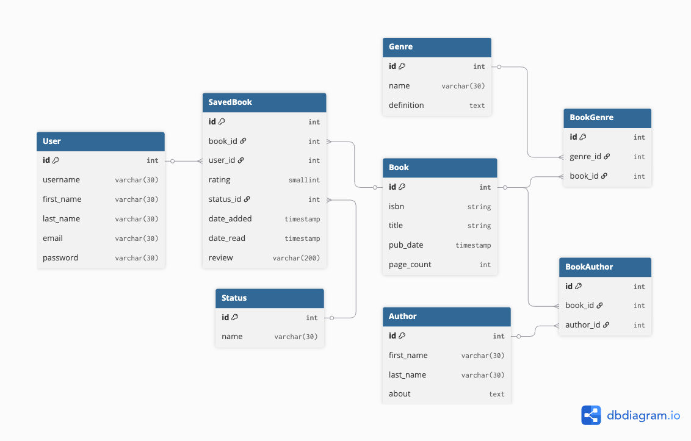

## Phase 1
This is the planning stage. Our goals are:
1. Plan our application with ERD, Wireframe and MVP definition
2. Implement Roo Code and Roo Flow for streamlined development
3. Set up dev environment with docker
4. Create project board with tickets

## Phase 2
This is MVP development stage. Our goals are:
1. Implement all mvp features for both Client and API
2. Practice professional team development

## Phase 3
This is the deployment stage. Our goals are: 
1. Integrate CI/CD pipeline
2. IAC with Terraform
3. Deployed client and api instances to Digital Ocean

## Phase 4 
This is the third party integration stage. Our goals are: 
1. Connect our application to services such as Amazon and Libby
2. Train an AI model for book recommendations
3. (Possible) implement social features in the application

